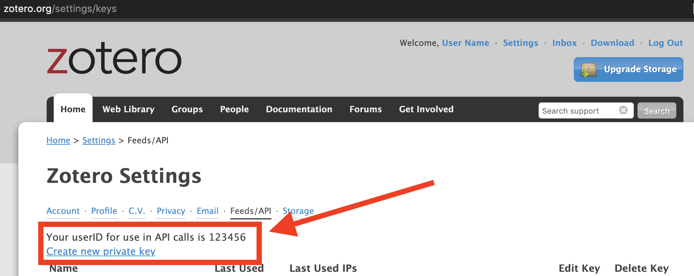
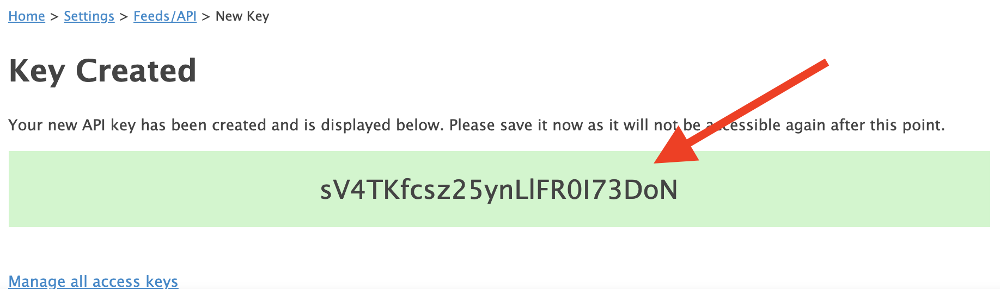

# Zotero BibLaTeX to GitHub

GitHub action to automatically retrieve your Zotero collection in BibLaTeX format at 8:00, 12:00 and 18:00 and save it as GitHub repository.

[](https://github.com/maehr/zotero-bib-to-gh/issues)
[](https://github.com/maehr/zotero-bib-to-gh/network)
[](https://github.com/maehr/zotero-bib-to-gh/stargazers)
[](https://github.com/maehr/zotero-bib-to-gh/blob/master/LICENSE.md)
[](https://pyup.io/repos/github/maehr/zotero-bib-to-gh/)
[](https://codeclimate.com/github/maehr/zotero-bib-to-gh/maintainability)
[](https://codeclimate.com/github/maehr/zotero-bib-to-gh/test_coverage)

## Installation

Make sure you have a [Zotero.org](https://www.zotero.org) account and sync your local installation with it.

- [Use this template](https://help.github.com/en/github/creating-cloning-and-archiving-repositories/creating-a-repository-from-a-template) or [fork](https://help.github.com/en/github/getting-started-with-github/fork-a-repo) this repo.
- Get `userID` for Zotero <https://www.zotero.org/settings/keys>

- Add `userID` as value of `ZOTERO_USER_ID` to [GitHub secrets](https://help.github.com/en/actions/configuring-and-managing-workflows/creating-and-storing-encrypted-secrets) of your repo
- Create a new `API Key` for Zotero <https://www.zotero.org/settings/keys/new>

- Copy the new `API Key`

- Add `API Key` as value of `ZOTERO_BEARER_TOKEN` to the [GitHub secrets](https://help.github.com/en/actions/configuring-and-managing-workflows/creating-and-storing-encrypted-secrets) of your repo

## Usage

Copy the link to <https://raw.githubusercontent.com/maehr/zotero-bib-to-gh/master/bibliography/zotero.bib> (i.e. <https://raw.githubusercontent.com/YOURNAME/zotero-bib-to-gh/master/bibliography/zotero.bib>).

Change `.github/workflows/zotero-bib-to-git.yml` to adjust the cronjob to your needs (check out [crontab.guru](https://crontab.guru/) if you are not familiar with cronjobs).
```YAML
on:
  schedule:
  - cron: "0 8,12,18 * * *"
```

## Support

This project is maintained by [@maehr](https://github.com/maehr). Please understand that we won't be able to provide individual support via email. We also believe that help is much more valuable if it's shared publicly, so that more people can benefit from it.

| Type                   | Platforms                                                    |
| ---------------------- | ------------------------------------------------------------ |
| 🚨 **Bug Reports**      | [GitHub Issue Tracker](https://github.com/maehr/zotero-bib-to-gh/issues) |
| 🎁 **Feature Requests** | [GitHub Issue Tracker](https://github.com/maehr/zotero-bib-to-gh/issues) |
| 🛡 **Report a security vulnerability**      | [GitHub Issue Tracker](https://github.com/maehr/zotero-bib-to-gh/issues) |

## Roadmap

No changes are currently planned.

## Contributing

Please read [CONTRIBUTING.md](CONTRIBUTING.md) for details on our code of conduct, and the process for submitting pull requests to us.

## Versioning

We use [SemVer](http://semver.org/) for versioning. For the versions available, see the [tags on this repository](https://github.com/maehr/zotero-bib-to-gh/tags).

## Authors and acknowledgment

- **Moritz Mähr** - _Initial work_ - [maehr](https://github.com/maehr)

See also the list of [contributors](https://github.com/maehr/zotero-bib-to-gh/graphs/contributors) who participated in this project.

## License

This project is licensed under the MIT License - see the [LICENSE.md](LICENSE.md) file for details
